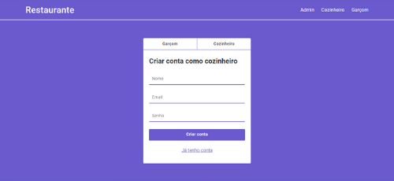
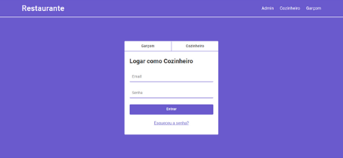
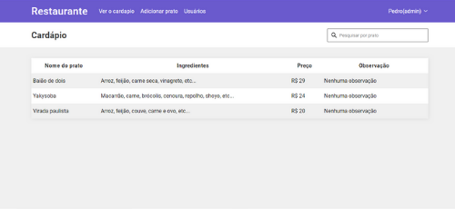
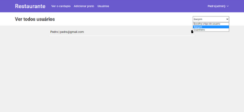
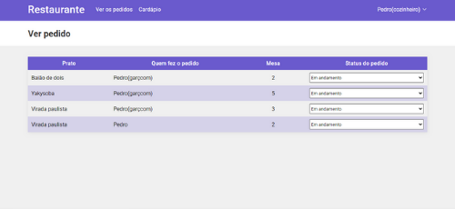
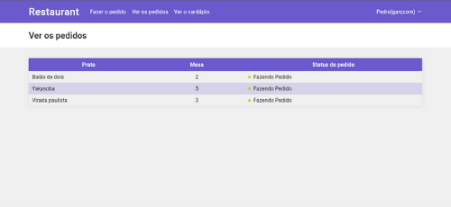
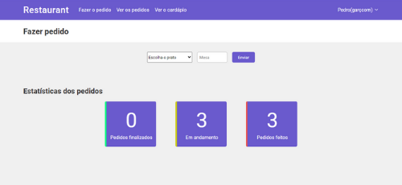

## Sistema para restaurante

### Sobre

<p> Esse projeto é um sistema para ajudar no controle de pedidos de um determinado restaurante, assim, não será mais preciso o uso das comandas pelos garçons. </p>
<span><strong>Importante:</strong> Esse projeto foi desenvolvido para fins de estudo.</span>

##

### Home


##

### Criar conta e Login

<div style='display: flex'>
  
  
</div>

##

### Cardápio

<p> O cardápio é o mesmo para todos os tipos de usuário com uma funcionalidade de pesquisar por pratos. </p>



##

### Admin

#### Funcionalidades
* Poderá excluir qualquer usuário(Garçom ou Cozinheiro); <br>
* Adicionar pratos ao cardápio; <br>
* Remover pratos do cardápio; <br>
* Ver o cardápio. <br> <br>

<div style='display: flex'>
  
  
</div>

##

### Cozinheiro

#### Funcionalidades

* Vai receber todos os pedidos que o garçom fazer; <br>
* Indicar se o status do pedido(recebido, em andamento ou pronto); <br>
* Ver o cardápio. <br> <br>



##

### Garçom

#### Funcionalidades

* Fazer os pedidos; <br>
* Ver o cardápio. <br> <br>

<div style='display: flex'>
  
  
</div>

##

### Pré-requisitos

<p> Antes de começar, você precisa ter instalado em sua máquina as seguintes ferramentas <a href='https://git-scm.com/downloads'> Git </a>, 
  <a href='https://nodejs.org/en/download/'> Node.js </a> . Além disso, é preciso ter um bom editor para trabalhar com o código como o <a href='https://code.visualstudio.com/'> VSCode</a>. </p>

#### Rodando o Front-end
 ``` bash
  # Clone esse repositório
  $ git clone <https://github.com/pedrosouz6/restaurant>
  
  # Acesse a pasta do projeto no terminal/cmd
  $ cd NomeDaPasta
  
  # Instale as dependências
  $ npm install
  
  # Execute a aplicação em modo de desenvolvimento
  $ npm start
  
  # o servidor iniciará na porta:3000 - acesse <http://localhost:3000>
```

##

### Tecnologias usadas

<div style='display: flex;'>
  
  
  
  
  
  
</div>

##

<p> Desenvolvido por Pedro Souza </p>
