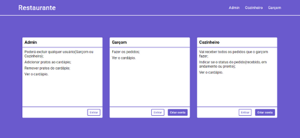
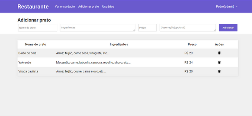

### System for restaurant

* Type 1: Cooker
* Type 2: Waiter
* Type 3: Admin

# Admin

### Funcionalidades

* Poderá excluir qualquer usuário(Garçom ou Cozinheiro);  
* Adicionar pratos ao cardápio;  
* Remover pratos do cardápio;  
* Ver o cardápio.    

